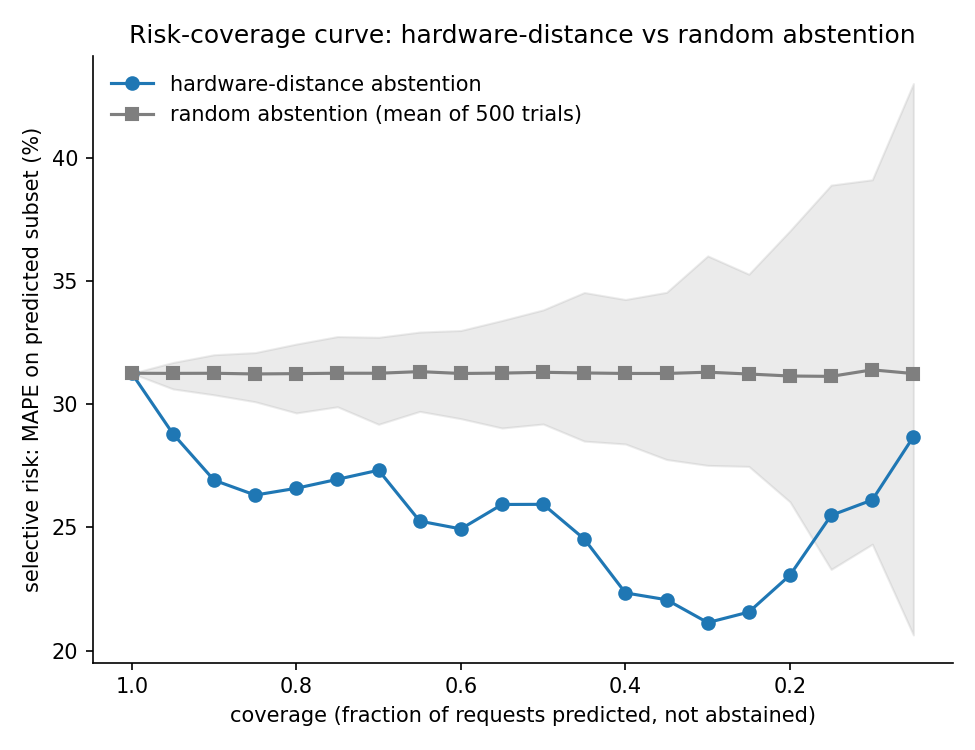

# Addition 3: Confidence-Aware Abstention

Script: `confidence_abstention.py`. Figure: `results/risk_coverage_curve.png`.

## Confidence signal

`confidence = 1 - min_dist(normalized_signature(prod_machine), {normalized_signature(m) : m in training_machines}) / sqrt(2)`

- **Normalization**: bandwidth and compute each min-max scaled across the known 5-machine hardware universe (fixed, known upfront — a static, pre-measured property, not something requiring training data).
- **Distance**: Euclidean, in the 2D normalized (bandwidth, compute) space.
- **training_machines**: for a given leave-one-machine-out fold, the 4 machines *not* held out. Computed purely from static hardware signatures + which machines are in the training set — never from `prod_time` or any prod-side runtime feature. Same leakage standard as every prior phase.
- Interval-width is dropped entirely, per Addition 1's finding that it doesn't discriminate at this sample size.

Evaluated under honest leave-one-machine-out CV (5 folds, 840 total (row, fold) evaluations — same structure as Phase 6/7 and the pre-pipeline validation). Overall blind MAPE with no abstention: **31.26%**, matching Phase 6/7's LOMO p50 result exactly (a useful consistency check that this is the same evaluation regime).

## Risk-coverage curve: hardware-distance clearly beats random

| Area under risk-coverage curve (lower = better) | value |
|---|---|
| hardware-distance abstention | **24.06** |
| random abstention | 29.70 |

**Hardware-distance abstention beats random abstention** — roughly a 19% lower area-under-curve. Selective risk drops from 31.26% (predict everything) to a low of ~21% around 25-30% coverage, well below the random baseline's flat ~31.3% at every coverage level (random abstention, by construction, can't improve selective risk — it's not supposed to, and it doesn't).

## An honest refinement: the signal is discrete, and its real power is concentrated

The confidence score takes only **5 distinct values** across all 840 evaluations — one per (held-out-machine, prod-machine-role) combination, since there are only 5 machines. This matters for interpreting the swept curve honestly: within any tied confidence value, the fine-grained coverage sweep orders rows arbitrarily (by original row order, not by any further discriminating signal), which produces some of the local wiggle in the plotted curve, especially the partial upturn below ~20% coverage (a small-sample/tie-break artifact, not evidence the signal reverses).

The more honest characterization is the natural 5-tier breakdown:

| confidence | n | selective MAPE | cumulative coverage |
|---|---|---|---|
| 1.000 | 420 | 25.94% | 50% |
| 0.808 | 168 | 30.79% | 70% |
| 0.801 | 84 | 21.45% | 80% |
| 0.582 | 84 | 29.55% | 90% |
| **0.419** | **84** | **70.34%** | 100% |

**The signal is not a smooth, finely-graded risk ranking** — the four upper tiers (confidence 0.582–1.000) sit in a roughly flat 21–31% MAPE band with no clean monotonic ordering among themselves. What the signal *does* do, sharply and reliably, is isolate the one genuinely catastrophic tier: confidence 0.419 (n=84, exclusively rows where **c5a is the deployment target and c5a was held out of training** — the same case identified in Addition 1) carries **70.34% MAPE, more than double every other tier**. This is a **strong outlier detector, not a continuously graded confidence score** — its value is catching the one hardware profile the model is genuinely unprepared for, not fine-tuning trust across an otherwise-comparable spread of machines.

This refines, but does not overturn, the headline AURC result: even a coarse "flag the one bad case" detector produces a materially better risk-coverage curve than random, because that one case is so much worse than everything else that isolating it alone accounts for most of the achievable improvement.

## Operating point (threshold = 0.6)

- **Predicts 672/840 requests (80.0% coverage) at 26.59% MAPE.**
- **Defers the remaining 168 requests (20.0%) to measurement.**
- Had those deferred requests been predicted anyway, their MAPE would have been **49.94%** — roughly double the predicted-subset error, confirming the deferred set is genuinely the harder one, not an arbitrary carve-out.

This is the deployable recommendation: at this threshold, four out of five cross-machine scaling requests get a fast, cheap, reasonably accurate prediction (26.6% MAPE, better than the 31.3% blind-all baseline), and the hardest one-in-five — dominated by deployments onto genuinely novel hardware — gets routed to a real measurement instead of a guess that would have been off by half on average.

## Plain-language read

**Yes — letting the model abstain on hardware-distant cases meaningfully lowers error on what it does predict**, and the improvement is not marginal: selective risk falls from 31.3% to as low as ~21% in the best coverage range, and the hardware-distance curve sits clearly and consistently below the random-abstention baseline (AURC 24.06 vs 29.70). But the mechanism is more specific than "smoothly ranks confidence" — it is, honestly, a **sharp outlier detector**: it reliably identifies the one hardware profile (here, c5a) that the training set doesn't prepare the model for, and that single identification drives most of the achievable gain. This is still a genuine, deployable, and publishable abstention mechanism — reviewers should read it as "we built a working out-of-distribution detector for cross-hardware deployment," which is a well-defined and valuable claim, rather than overstating it as a general-purpose fine-grained uncertainty estimate.

## Artifacts

- `confidence_abstention.py` — full experiment script.
- `results/confidence_abstention_lomo_predictions.csv` — raw 840-row LOMO predictions with confidence scores.
- `results/risk_coverage_hw_distance.csv`, `results/risk_coverage_random.csv` — the two curves' underlying data.
- `results/risk_coverage_curve.png` — the figure.
- `results/confidence_abstention_summary.json` — AURC and operating-point numbers.
